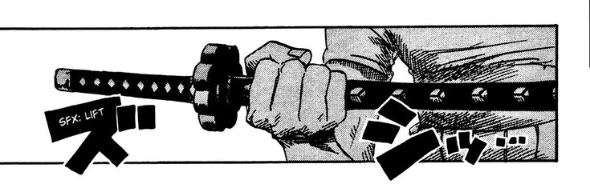
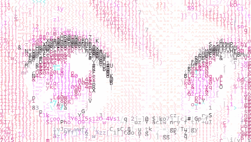

  

# Know About Me

  

Hey there! I'm Pavan, an Artificial Intelligence & Data Science student at AITM with a strong interest in building technology that makes a real impact. I enjoy exploring the intersection of software, artificial intelligence, and embedded systems while constantly learning new tools and technologies.

My journey so far has involved creating projects such as the **Smart Blind Stick**, an Arduino-based assistive navigation system designed to help visually impaired individuals, and my **personal portfolio website**, where I showcase my projects, skills, and growth as a developer. Through these projects, I've gained hands-on experience in problem-solving, web development, and hardware integration.

I aspire to build innovative applications that combine **AI, modern web technologies, and IoT systems** to solve real-world challenges. My goal is to become a developer who not only writes code but creates meaningful solutions that improve people's lives. Every project I build is another step toward that vision.

# Top Projects

🔹 **Smart Blind Stick**  
Arduino assistive navigation system for visually impaired individuals.

🔹 **Portfolio Website**  
Modern personal portfolio showcasing projects and skills.

🔹 **AI Projects**  
Experiments in machine learning, AI, and data science.

 
