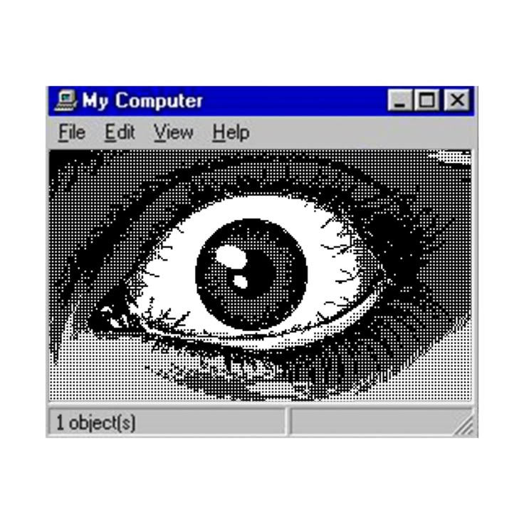

<div align="center">

<p align="center">
  
</p>

<a href="https://readme-typing-svg.demolab.com/">

</a>

<br/>


<br/><br/>

<a href="https://pavn31.dpdns.org/">

</a>
<a href="https://www.linkedin.com/in/pavn-badiger">

</a>
<a href="mailto:pavnbadiger@gmail.com">

</a>
<a href="https://github.com/Pavn31">

</a>

<br/><br/>


</div>

---

## About

I am an **AI & Data Science student** focused on building practical software systems across **artificial intelligence, machine learning, cybersecurity, automation, and full-stack development**.

My approach combines engineering fundamentals with experimentation: understand the problem, design the system, build the implementation, test it, and continuously improve it.

I am particularly interested in:

- Software engineering and system design
- Artificial Intelligence and Machine Learning
- Cybersecurity and security automation
- Full-stack web development
- Developer tooling and Linux
- Embedded systems and hardware projects
- Product-oriented engineering

### Open To

- Software engineering opportunities
- AI / ML projects
- Cybersecurity projects
- Open-source collaboration
- Student engineering projects
- Technical internships

---

## Tech Stack

### Languages

<p>

</p>

### Frontend

<p>

</p>

### Backend & Databases

<p>

</p>

### Cloud, DevOps & Tooling

<p>

</p>

---

## AI / ML Expertise

| Domain | Proficiency | Details |
|---|---|---|
| Python | Advanced | Primary language for AI, automation and backend development |
| Machine Learning | Developing | Model experimentation and applied ML workflows |
| Artificial Intelligence | Developing | AI-powered applications and intelligent systems |
| Data Science | Developing | Data processing, analysis and practical experimentation |
| Computer Vision | Developing | Exploration of vision-based intelligent systems |
| AI Security | Developing | AI-assisted cybersecurity and detection concepts |
| Automation | Developing | Python-based tooling and automated workflows |

---

## Featured Projects


---

<details>
<summary><strong>Smart Blind Stick</strong></summary>

<br/>

An Arduino-based assistive technology project designed to improve mobility and situational awareness through obstacle detection, location tracking, GSM communication and voice guidance.

| Category | Details |
|---|---|
| **Stack** | Arduino UNO, C/C++, HC-SR04, GPS, GSM |
| **Scale** | Embedded assistive technology prototype |
| **Performance** | Real-time sensor-based obstacle detection |
| **Security** | GSM-based emergency communication |
| **Impact** | Designed to improve navigation and emergency awareness |
| **Repository** | [GitHub](https://github.com/Pavn31/Smart-Blind-Stick) |

### Engineering Scope

- Ultrasonic obstacle detection
- GPS location tracking
- GSM emergency communication
- Buzzer-based alerts
- Voice guidance concepts
- Embedded hardware integration
- Arduino-based control logic

</details>

---

<details>
<summary><strong>Portfolio — Pavn31</strong></summary>

<br/>

A personal engineering portfolio focused on presenting projects, technical work, experiments and development progress through a minimal modern interface.

| Category | Details |
|---|---|
| **Stack** | HTML, CSS, JavaScript |
| **Scale** | Personal developer portfolio |
| **Performance** | Lightweight frontend architecture |
| **Security** | HTTPS deployment and DNS configuration |
| **Impact** | Centralized technical and project presence |
| **Repository** | [GitHub](https://github.com/Pavn31/Portfolio) |

### Engineering Scope

- Responsive web design
- Project showcase
- Technical blog
- Project documentation
- Contact integrations
- Modern UI interactions
- Cloud-based deployment

</details>

---

## Experience

### Student Developer & Independent Builder

**2025 — Present**

Focused on academic development and independent software/hardware projects across AI, cybersecurity, web development and embedded systems.

#### Scope

- Building practical software projects
- Developing AI and cybersecurity concepts
- Experimenting with Linux and developer tooling
- Designing full-stack applications
- Developing embedded Arduino systems
- Maintaining GitHub repositories
- Documenting technical work
- Exploring system-level engineering

`Python` `C/C++` `JavaScript` `Linux` `Git` `AI/ML` `Cybersecurity`

---

## Achievements

<div align="center">

| Recognition | Details |
|---|---|
| Engineering Projects | Built practical AI, cybersecurity and embedded-system projects |
| Open Source | Maintains public technical projects on GitHub |
| AI & Data Science | Academic focus with independent AI/ML experimentation |
| Cybersecurity | Developed network monitoring and attack-detection concepts |
| Embedded Systems | Designed Arduino-based assistive technology |

</div>

---


## Coding Profiles

<div align="center">

<a href="https://leetcode.com/">

</a>

<a href="https://www.geeksforgeeks.org/">

</a>

<a href="https://www.hackerrank.com/">

</a>

<a href="https://www.codechef.com/">

</a>

</div>

---

## GitHub Analytics

<div align="center">


</div>

---


## Contribution Activity

<div align="center">


</div>

---

## Contribution Snake

<div align="center">


</div>

---

## Current Focus

```yaml
profile:
  name: Pavn31
  role: "AI & Data Science Student"
  focus:
    - Software Engineering
    - Artificial Intelligence
    - Machine Learning
    - Cybersecurity
    - Full-Stack Development

learning:
  - Advanced Python
  - Machine Learning
  - AI Engineering
  - System Design
  - Cybersecurity

building:
  - DecAI
  - Security Detection Systems
  - Full-Stack Applications
  - Developer Tools

exploring:
  - Linux Systems
  - AI Security
  - Automation
  - Embedded Systems
  - Open Source

open_to:
  - Internships
  - Open Source
  - AI/ML Projects
  - Cybersecurity Projects
  - Software Engineering Opportunities
````

---

## Connect

<div align="center">

<a href="mailto:pavnbadiger@gmail.com">

</a>

<a href="https://www.linkedin.com/in/pavn-badiger">

</a>

<a href="https://github.com/Pavn31">

</a>

<a href="https://pavn31.dpdns.org/">

</a>

</div>

---

<div align="center">

> **Build systems. Solve problems. Keep learning.**


</div>

